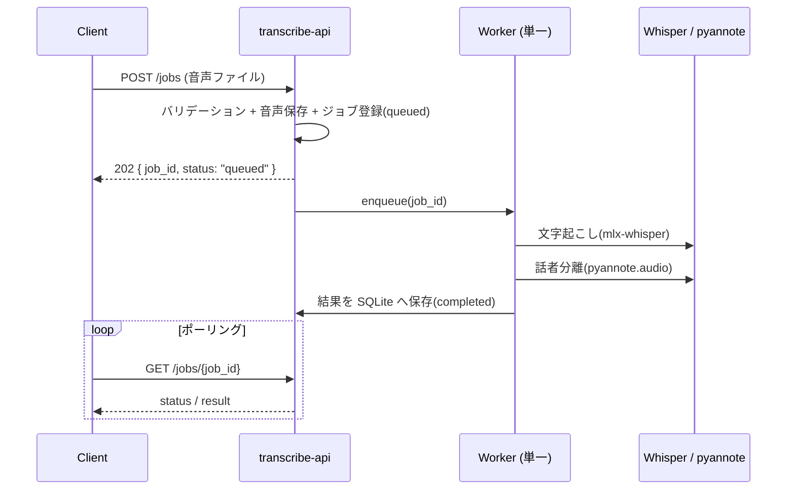

# transcribe-api — 要件定義書 (SPEC)

音声ファイルを受け取り、**mlx-whisper による文字起こし**と **pyannote.audio による話者分離**の結果を返す非同期 API サーバの仕様書。

---

## 1. 概要 / 目的

- **目的**: アップロードされた音声ファイルに対し、文字起こし（transcription）と話者分離（speaker diarization）を実行し、その結果データを返す API を提供する。
- **利用形態**: 処理に時間がかかるため **非同期ジョブ方式**。クライアントは音声を POST してジョブを受け付けさせ、`job_id` でポーリングして結果を取得する。
- **出力方針**: 文字起こし結果と話者分離結果は**突合せず、それぞれ別配列（分離形式）**で返す。クライアント側で任意に結合できる。

---

## 2. 前提・制約

- **Apple Silicon (Metal) 必須**: `mlx-whisper` は Apple の MLX(Metal) フレームワークに依存し、Linux/CUDA では動作しない。
  → **本サービスは Docker 化しない**。macOS ホスト上で native 実行し、Caddy 経由で公開する（他サービスと同一 URL 体系を維持）。
- **HuggingFace トークン必須**: `pyannote.audio` の話者分離モデル（`pyannote/speaker-diarization-3.1`）は、
  HuggingFace 上で利用規約への同意 + アクセストークン (`HF_TOKEN`) が必要。未設定時は起動失敗（fail-fast）とする。
- **GPU(Metal) は逐次処理**: 単一 GPU を共有するため、ワーカ並列度の既定は `1`（`WORKER_CONCURRENCY` で変更可）。
- **依存管理**: 本サービスのみ Docker 前提の `requirements.txt` ではなく、グローバル規約（macOS/uv 優先）に沿って **`pyproject.toml` + `uv`** を採用する（他サービスとの相違点）。

---

## 3. アーキテクチャ

- **フレームワーク**: FastAPI + Uvicorn。既存サービス同様フラットモジュール構成（app factory なし、設定は `os.getenv()` を import 時に読む）。
- **モデルロード**: `lifespan`（`@asynccontextmanager`）で Whisper / pyannote モデルを起動時に一度だけロードし `app.state` に保持（trouble-api の warm-up パターンに準拠）。
- **GPU 利用**: mlx-whisper は Metal(MLX) で動作。pyannote は起動時に `PYANNOTE_DEVICE`（既定 `auto`→MPS）へ `pipeline.to(device)` で移動する。MPS 未対応演算に備え `run.sh` で `PYTORCH_ENABLE_MPS_FALLBACK=1`（未対応演算のみ CPU フォールバック）を設定。
- **音声デコード（話者分離）**: ファイル直読み時のデコーダ由来のサンプル数不一致（例: `resulted in N samples instead of expected M`）を避けるため、`torchaudio.load` で波形をメモリへ読み込み `{waveform, sample_rate}` の dict で pyannote へ渡す。
- **非同期ジョブ処理**:
  1. `POST /jobs` 受付時に音声を作業ディレクトリ（`WORK_DIR`）へ保存し、ジョブを `queued` で登録。
  2. バックグラウンドワーカ（単一ワーカ / asyncio queue または threadpool）が順次取り出し、`processing` → 文字起こし → 話者分離 → `completed` と遷移。失敗時は `failed` + `error`。
  3. ジョブ状態・結果は **SQLite に永続化**（プロセス再起動耐性）。音声/結果ファイルは `WORK_DIR` 配下に配置。
- **公開経路**: Caddy(`:80`) → `reverse_proxy host.docker.internal:8007` → 本サービス。外部公開は ngrok 経由。

### 処理フロー



---

## 4. API エンドポイント仕様

### `POST /jobs`
- **概要**: 音声をアップロードしジョブを受け付ける。
- **Content-Type**: `multipart/form-data`
- **フィールド**:
  - `file` (必須): 音声ファイル。許可 content-type: `audio/wav, audio/x-wav, audio/mpeg, audio/mp4, audio/m4a, audio/flac, audio/ogg`（+ 拡張子検証）。最大サイズは `MAX_UPLOAD_MB`。
  - `language` (任意): 文字起こし言語。既定は `WHISPER_LANGUAGE`（`ja`）。
  - `model` (任意): Whisper モデル名。既定は `WHISPER_MODEL`。
  - `num_speakers` (任意): 話者数が既知の場合に指定（pyannote へのヒント）。
- **レスポンス**: `202 Accepted`
  ```json
  { "job_id": "uuid", "status": "queued", "created_at": "..." }
  ```

### `GET /jobs/{job_id}`
- **概要**: ジョブ状態を取得。`completed` 時は結果スキーマ（§5）を含む。
- **status**: `queued | processing | completed | failed`
- **failed 時**: `error` フィールドにメッセージを含む。
- 存在しない `job_id` は `404`。

### `GET /jobs/{job_id}/result`
- **概要**: 結果のみを取得（§5 のスキーマ）。未完了なら `409`、存在しなければ `404`。

### `GET /jobs`（任意）
- **概要**: ジョブ一覧をページングで取得（`limit`, `offset`）。

### `DELETE /jobs/{job_id}`（任意）
- **概要**: ジョブおよび成果物（音声・結果）を削除。

### `GET /health`
- **概要**: ヘルスチェック。
  ```json
  { "status": "ok", "models_loaded": true }
  ```

---

## 5. 結果スキーマ（分離形式）

Pydantic の `response_model` として定義する。`transcription` と `diarization` は突合せず別々に返す。

```json
{
  "job_id": "uuid",
  "status": "completed",
  "audio": {
    "filename": "meeting.wav",
    "content_type": "audio/wav",
    "duration_sec": 123.4
  },
  "transcription": {
    "model": "mlx-community/whisper-large-v3-mlx",
    "language": "ja",
    "text": "全文のテキスト...",
    "segments": [
      { "id": 0, "start": 0.0, "end": 3.2, "text": "こんにちは。" }
    ]
  },
  "diarization": {
    "model": "pyannote/speaker-diarization-3.1",
    "num_speakers": 2,
    "segments": [
      { "start": 0.0, "end": 3.5, "speaker": "SPEAKER_00" }
    ]
  },
  "created_at": "2026-07-03T10:00:00+09:00",
  "completed_at": "2026-07-03T10:02:11+09:00"
}
```

---

## 6. 設定（環境変数）

| 変数名 | 既定値 | 説明 |
| --- | --- | --- |
| `WHISPER_MODEL` | `mlx-community/whisper-large-v3-mlx` | 文字起こしモデル |
| `WHISPER_LANGUAGE` | `ja` | 既定言語（`auto` で自動判定） |
| `HF_TOKEN` | （必須・既定なし） | HuggingFace アクセストークン。未設定は起動失敗 |
| `DIARIZATION_MODEL` | `pyannote/speaker-diarization-3.1` | 話者分離モデル |
| `PYANNOTE_DEVICE` | `auto` | 話者分離の使用デバイス（auto/mps/cuda/cpu）。auto は Metal(MPS)優先 |
| `PORT` | `8007` | 待受ポート |
| `WORK_DIR` | `./work` | 音声・結果の作業ディレクトリ |
| `DATABASE_URL` | `sqlite:///./work/jobs.db` | ジョブ永続化先 |
| `MAX_UPLOAD_MB` | `500` | アップロード最大サイズ(MB) |
| `WORKER_CONCURRENCY` | `1` | バックグラウンドワーカ並列度 |
| `JOB_RETENTION_HOURS` | `24` | 成果物の自動削除までの保持時間 |

- `.env.example` に上記の雛形を用意する（**実値は含めない**。`HF_TOKEN` はプレースホルダ）。

---

## 7. ディレクトリ構成（予定）

```
transcribe-api/
  main.py          # FastAPI app + lifespan + routes
  models.py        # Pydantic schemas（リクエスト/結果）
  transcriber.py   # mlx-whisper ラッパ
  diarizer.py      # pyannote.audio ラッパ
  jobs.py          # ジョブストア(SQLite) + バックグラウンドワーカ
  config.py        # os.getenv 集約
  pyproject.toml   # uv 管理（fastapi, uvicorn, python-multipart, mlx-whisper, pyannote.audio, torch, torchaudio, sqlalchemy 等）
  .env.example
  static/          # 任意: 簡易アップロード UI（RedirectResponse で index.html）
  tests/           # conftest.py で mlx-whisper/pyannote を sys.modules スタブ、test_*.py
  scripts/run.sh   # native 起動スクリプト
  README.md
  SPEC.md
```

---

## 8. デプロイ・公開手順

- **環境構築**（macOS ホスト）:
  ```bash
  cd transcribe-api
  uv venv
  uv sync
  ```
- **起動**: `scripts/run.sh`（`.env` を読み込み、`PYTORCH_ENABLE_MPS_FALLBACK=1` を設定して `uv run uvicorn main:app --host 0.0.0.0 --port 8007` を実行）。常駐化（launchd 等）は将来検討。
- **Caddy へ追加する route**（実装フェーズで `caddy/Caddyfile` に反映。ここでは記載のみ）:
  ```
  route /transcribe* {
      uri strip_prefix /transcribe
      reverse_proxy host.docker.internal:8007
  }
  ```
- **docker-compose には追加しない**（native 実行のため）。
- **公開 URL**: `https://<ngrok-domain>/transcribe/...`

---

## 9. エラーハンドリング / バリデーション / セキュリティ

- **入力検証**: content-type + 拡張子 + サイズ（`MAX_UPLOAD_MB`）を検証。不正時は `HTTPException`（日本語 `detail`）。
- **fail-fast**: `HF_TOKEN` 未設定は起動時に `RuntimeError`（ocr-api の起動時チェックパターンに準拠）。
- **個人情報保護**: 音声は個人情報を含み得るため、
  - 成果物は `JOB_RETENTION_HOURS` 経過後に自動削除する。
  - **ログに文字起こし本文・音声内容を出力しない**（ジョブ ID / 状態のみ）。
- **公開時**: 必要に応じて Caddy の `basic_auth` を適用（将来オプション）。

---

## 10. テスト方針

- **pytest** を使用。`mlx-whisper` / `pyannote.audio` は重く Apple 依存のため、`conftest.py` で `sys.modules` にスタブを注入し、モデル本体をロードせずにテストする（trouble-api 流儀）。
- **対象**: ジョブ状態遷移（queued→processing→completed/failed）、入力バリデーション、結果スキーマの整合性。
- **詳細なテスト計画** → [TESTPLAN.md](./TESTPLAN.md)

---

## 11. 将来拡張（スコープ外）

- 話者ラベルと文字起こしの突合せ（統合形式）出力。
- SRT / VTT 字幕形式のエクスポート。
- SSE による処理進捗のリアルタイム通知。
- 話者数指定・話者クラスタリングの高度化。
